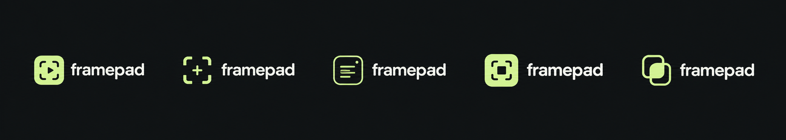

**Framepad** is a native macOS app for marking up videos with frame captures, crops, and notes. Organize moments into groups, revisit them precisely, and turn your observations into research material or video question-answering datasets. Projects reference the original video, so you can work without duplicating large files.

## Installation

1. [Download Framepad 1.6.0](https://github.com/strangecreator/framepad/raw/refs/heads/main/dist/Framepad-1.6.0.dmg).
2. Open the DMG and drag **Framepad** into **Applications**.
3. Launch Framepad on **macOS 14 Sonoma or later**, on Apple silicon or Intel.

The current build is not notarized. If macOS blocks it, attempt to open it, then use **System Settings → Privacy & Security → Open Anyway**. A [SHA-256 checksum](dist/Framepad-1.6.0.dmg.sha256) is included with the installer.

## Usage

1. Create a project, choose a local video, and save the `.framepad` project.
2. Play or scrub to a moment. Optionally enable cropping and drag a rectangle; move or resize it by dragging its interior, edges, or corners.
3. Write an optional note and press **⌘Return** to save a **vbox**: a frame or crop, description, precise timestamp, and frame index. Use **⌘/** for a note without an image.
4. Create groups for related moments. Click a group header to direct new vboxes into it, or drag existing vboxes between groups. Group members are ordered by video time.
5. Click a vbox to revisit and edit it. Notes autosave; **⌘Return** also replaces its capture with the current frame and crop. Click **Back to draft** or empty collection space to resume your previous draft.

Use a group's **•••** menu to rename or remove it. Edit its description below the group and press **Return** to save. The collection's down-arrow button returns you to the newest entries.

Keep the original video available. If it moves, use **Relink source video** to locate the same file again.

## Example Pipeline

Use Framepad to build an egocentric video QA benchmark:

1. **Mark up the video.** Save useful frames and observations, and group related encounters.
2. **Identify landmarks.** Name distinctive landmark groups `SPECIAL: <name>` so questions can identify moments without timestamps.
3. **Generate questions with Codex.** Use [the QA generation prompt](prompts/qa_generation.md), filling in your project paths and output folder. It asks Codex to work from copies, inspect annotations and captures, and write SHORT questions before deriving MEDIUM and LONG questions.
4. **Review the CSVs.** Check that each question has one clear answer. Keep timestamps in the evidence column, and provide only the video and question to the system you evaluate.

The prompt produces separate SHORT and MEDIUM/LONG CSVs for each video, using:

```csv
question_group,question_type,question,answer,time_segments
```

This workflow was used to prepare questions from three annotated walking videos, covering visible attributes, spatial relationships, and actions. Question generation happens separately in Codex.

## Keyboard Shortcuts

| Action | Shortcut |
| :--- | :--- |
| Play / pause from any pane | ⌥Space |
| Play / pause outside text input | Space |
| Seek backward / forward 3 seconds outside text input | ← / → |
| Seek backward / forward from any pane | ⌘← / ⌘→ |
| Create / edit a crop | ⌘⇧C |
| Remove the crop | ⌘W |
| Focus the note editor | ⌘I |
| Save frame and note / update selected vbox | ⌘Return |
| Save note only | ⌘/ |
| Create a group | ⌘G |
| Delete selected vbox outside text input | Backspace |
| Undo / redo | ⌘Z / ⌘⇧Z |
| Save group description / insert a new line | Return / ⇧Return |
| New / open project | ⌘N / ⌘O |
| Save project | ⌘S |
| Back to projects | ⌘L |
| Close window | ⌘⇧W |

Hold a seek shortcut to keep moving. While typing, ordinary arrows and Space retain their text-editing behavior. Open the keyboard button in the app for a quick reference.

## Export

Framepad saves your work as a `.framepad` project. To access its contents, right-click it in Finder and choose **Show Package Contents**: captures are in `captures/`, and notes, groups, and timing metadata are in `project.json`.

There is no built-in QA CSV exporter; use the [generation prompt](prompts/qa_generation.md) for that workflow. Share the project together with access to its original video, which is stored separately.

## Collaboration

Share a copy of a project for review, and relink its video on the receiving Mac if needed. Coordinate edits to one working copy at a time; Framepad does not provide live collaborative editing.

For app changes, open an issue or pull request with a short description and reproduction steps. To build locally, install Xcode or Apple's Command Line Tools, then run:

```sh
bash scripts/test.sh
bash scripts/build.sh
bash scripts/package-dmg.sh
```

The app and installer are written to `dist/`.

## License

[MIT](LICENSE) · Copyright © 2026 Solomon Andriushchenko.
